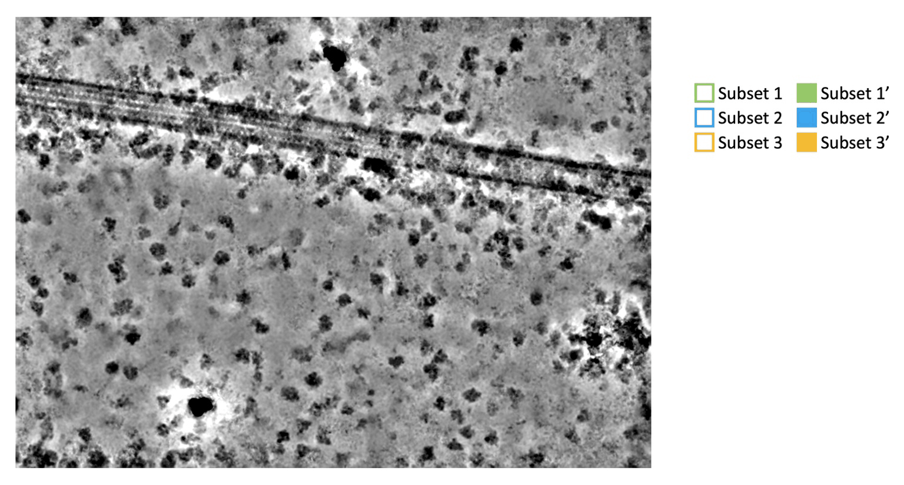

# CryoSPARC particle overlay

`cs_particle_overlay.py` places CryoSPARC 2D class averages back onto their source micrograph thumbnails for visual inspection of particle distributions and molecular context, following the same general approach as ReconSil (https://doi.org/10.1016/bs.mie.2022.03.016) as executed in relion_particle_reposition.



## What it does

The script reads CryoSPARC `.cs` files from select-2D jobs and joins per-particle 2D class, pose, and shift information to source micrograph locations. It then:

- matches micrograph thumbnails to source micrographs using the stable `FoilHole_...` acquisition identifier;
- tolerates leading UIDs and preprocessing suffixes such as dose-weighting and denoising;
- accounts for different thumbnail dimensions and rescales templates accordingly;
- applies CryoSPARC's positive in-plane pose and inverse shift convention;
- vertically flips the micrograph background to match CryoSPARC display coordinates;
- optionally low-pass filters thumbnails;
- writes grayscale, coloured, and transparent template-only PNGs.

## Requirements

Python 3 with:

```bash
pip install numpy scipy pillow mrcfile
```

Run the script from a directory containing the CryoSPARC job directories and the subset STAR files, or provide paths to them.

## Recommended CryoSPARC workflow

1. If importing particles, preserve micrograph linkage.

2. Iteratively perform 2D classifications (script works for multiple particle subsets) until class averages are well defined.

3. Select useful 2D classes in one or more select-2D jobs, for example `J6317`, `J6318`, and `J6319`.

4. If needed, use Particle Sets Tools to divide selected particles into further subsets.

5. Convert each particle-set output to STAR format, ensuring class number information is written to the output file. In the particle-set job directory, for example:

   ```bash
   module load PYEM
   csparc2star.py J6320_passthrough_intersect.cs intersect.cs J6320_particles.star
   ```

   The STAR file is used only as a pointer to a subset. All rendering metadata comes from the CryoSPARC `.cs` files in the select-2D job.

6. Identify a manageable set of micrographs for visualisation. Curate exposures using selected particles as input (use particle reassignment first if particles from signal-subtracted micrographs are to be repositioned onto original micrographs).

7. Optionally denoise the selected micrographs. 

8. Generate micrograph thumbnails at maximum resolution. For denoised thumbnails, ensure the generate thumbnails job receives only the micrograph_blob_denoised input and not micrograph_blob_non_dw. The script reads the `@1x` PNG paths recorded in the thumbnail job `.cs` file. Missing PNGs referenced by the manifest are skipped.

## Basic usage

With no subset STAR files, all particles available from one select-2D job (J6319 below) are overlaid onto the thumbnails in the generate micrograph thumbnails job (J6442 below).

```bash
python3 cs_particle_overlay.py J6319 \
  --mics J6442 \
  --out J6319/repositioned
```

`--ori-dimension` refers to the longest dimension of the original micrographs and defaults to `5760`.  No low-pass filtering is performed unless `--lowpassA` and --Apix (original micrograph pixel size) is supplied.

## One or more particle subsets

Each select-2D job may be followed by zero or more subset STAR files. A subset STAR may optionally be followed by a colour and display mode. The next select-2D job begins when a non-STAR positional argument is encountered.

Two subsets from one select-2D job:

```bash
python3 cs_particle_overlay.py \
  J6319 \
  J6324_particles.star DeepSkyBlue border dashed \
  J6325_particles.star DeepSkyBlue border \
  --mics J6456 \
  --out J6319/repositioned_J6456
```

Multiple select-2D jobs:

```bash
python3 cs_particle_overlay.py \
  J6317 \
    J6320_particles.star LimeGreen border dashed \
    J6321_particles.star LimeGreen border \
  J6319 \
    J6324_particles.star DeepSkyBlue border dashed \
    J6325_particles.star DeepSkyBlue border \
  J6318 \
    J6322_particles.star Yellow border dashed \
    J6323_particles.star Yellow border \
  --mics J6456 \
  --out J6319/repositioned_multi
```

The combined micrograph overlay uses the requested display modes. Individual transparent subset images remain grayscale and uncoloured. If colours are omitted, all outputs remain grayscale.

## Colours and display modes

Colours can be HTML/X11 names or hexadecimal RGB values:

```text
DeepSkyBlue
LightBlue
#0072B2
#E69F00
```

Names are case-insensitive; spaces, hyphens, and underscores are ignored. The script accepts the full set supported by Pillow's HTML/X11 colour parser.

Common colours shown by `-h` include:

```text
Maroon      #800000
Red         #FF0000
Pink        #FFC0CB
Orange      #FFA500
Khaki       #F0E68C
Yellow      #FFFF00
Blue        #0000FF
LightBlue   #ADD8E6
Green       #008000
LightGreen  #90EE90
DeepSkyBlue #00BFFF
LimeGreen   #32CD32
```

Display modes are:

- no mode: tint/recolour the template in the combined overlay;
- `border`: retain the grayscale template and draw a 4-pixel solid coloured border;
- `border dashed`: retain the grayscale template and draw a 4-pixel dashed coloured border.

Transparent subset outputs are not recoloured, regardless of the combined-overlay mode, to allow for manual downstream labelling and overlay.

## Filtering and scaling options

No low-pass filtering:

```bash
python3 cs_particle_overlay.py J6319 \
  --mics J6456 \
  --ori-dimension 5760 \
  --out J6319/repositioned_no_filter
```

With a 10 Å low-pass filter:

```bash
python3 cs_particle_overlay.py J6319 \
  --mics J6456 \
  --ori-dimension 5760 \
  --Apix 0.85 \
  --lowpassA 10 \
  --out J6319/repositioned_10A
```

The effective thumbnail pixel size is calculated as:

```text
effective_A_per_pixel = Apix × thumbnail_long_dimension / ori_dimension
```

The same scale ratio is applied to the class templates. This is important when full-resolution thumbnails are replaced by smaller denoised thumbnails, such as 1707 pixels across the long dimension.

## Output files

With subset STAR files, each micrograph produces:

```text
_1_original.png
_2_repositioned_all.png
_3_<subset-name>.png
_4_<subset-name>.png
...
_<last>_all_coloured_templates.png
```

The original and repositioned images contain the vertically flipped micrograph background. The subset and combined-template-only images have transparent backgrounds.

Without subset STAR files, the script produces:

```text
_1_repositioned.png
_2_original.png
_3_templates.png
```

## Help

For the complete argument list, colour table, syntax, and output description:

```bash
python3 cs_particle_overlay.py -h
```

## Caveats

- The `0.04` template mask threshold and 10-pixel mask padding were tuned for one dataset and may need adjustment for different class-average intensity scales.
- Subset STAR files must refer to the same particle lineage/blob identity as the relevant select-2D job for exact filtering.
- The script skips thumbnails listed in the `.cs` manifest that are not present on disk.
- The vertical micrograph flip is intentional and reflects the CryoSPARC display-coordinate convention used here.
